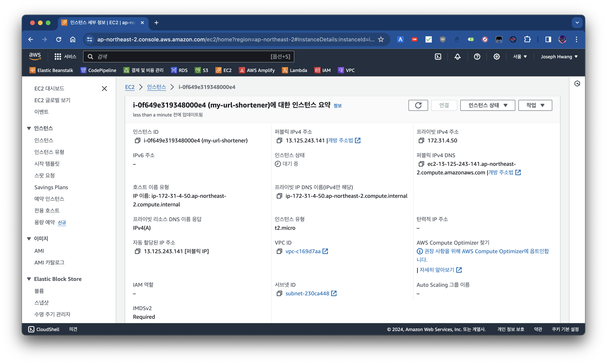
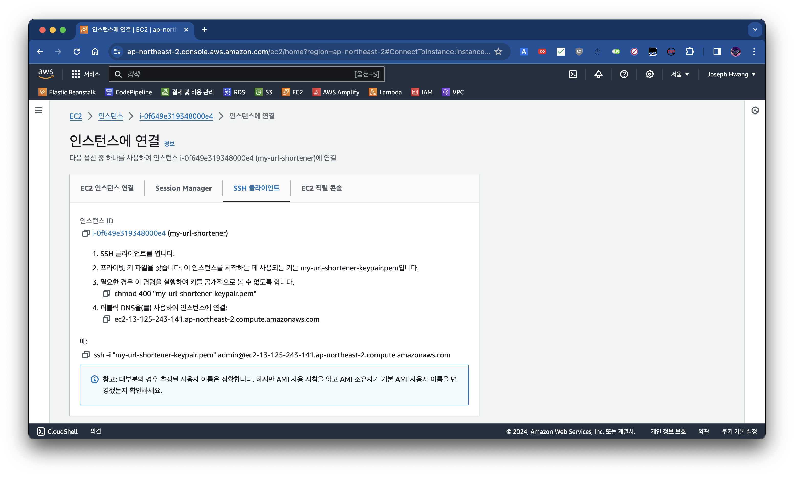

# How to connect to EC2 instance

본 문서에서는 AWS EC2 인스턴스에 접속하는 방법에 대해 다룹니다.

## Pre-requisites

- EC2 인스턴스
- EC2 인스턴스에 접속할 수 있는 키페어


## Steps

### 1. `cd` to the directory where your `.pem` file is located

인스턴스 생성 시 다운로드 받은 프라이빗 키 (`.pem`) 파일이 있는 디렉토리로 이동합니다.

```bash
cd /path/to/your/pem/file
```

### 2. Change the permission of the `.pem` file

키페어 파일에 대한 권한을 변경합니다. ([참조 1](#참조-1-aws-인스턴스-연결-페이지) 참조) 이 과정을 거치지 않으면 `.pem` 파일에 부여된 권한이 너무 넓은 이유로 `Permission denied` 에러가 발생할 수 있습니다.

```bash
chmod 400 your-key-pair.pem
```

### 3. Connect to the EC2 instance

아래 명령어를 사용하여 EC2 인스턴스에 접속합니다. (([참조 1](#참조-1-aws-인스턴스-연결-페이지) 참조) 참조)

```bash
ssh -i "your-key-pair.pem" admin@your-ec2-instance-public-dns
```

### 참조 1: AWS 인스턴스 연결 페이지

아래는 AWS Management Console에서 EC2 인스턴스를 선택하고, `연결` 버튼을 클릭한 후 나오는 페이지입니다.





