# How to create EC2 instance

본 문서에서는 AWS EC2 인스턴스를 생성하는 방법에 대해 다룹니다.

## Pre-requisites

- AWS 계정

## Steps

### 1. AWS Management Console 접속

[AWS Management Console](https://aws.amazon.com/console/)에 접속합니다.

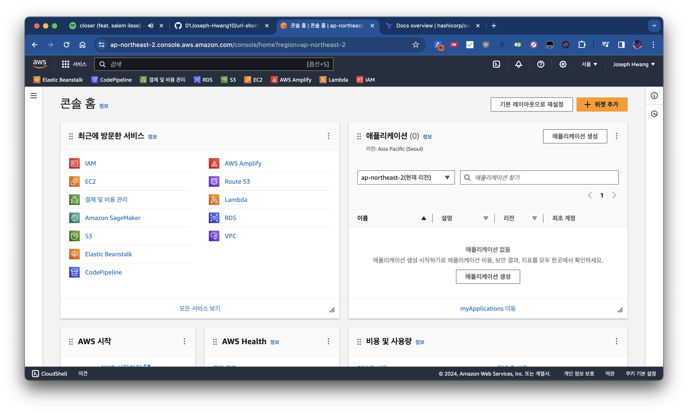

### 2. EC2 서비스 찾기

AWS Management Console 상단의 `Find Services` 검색창에 `EC2`를 입력하여 EC2 서비스를 찾습니다.

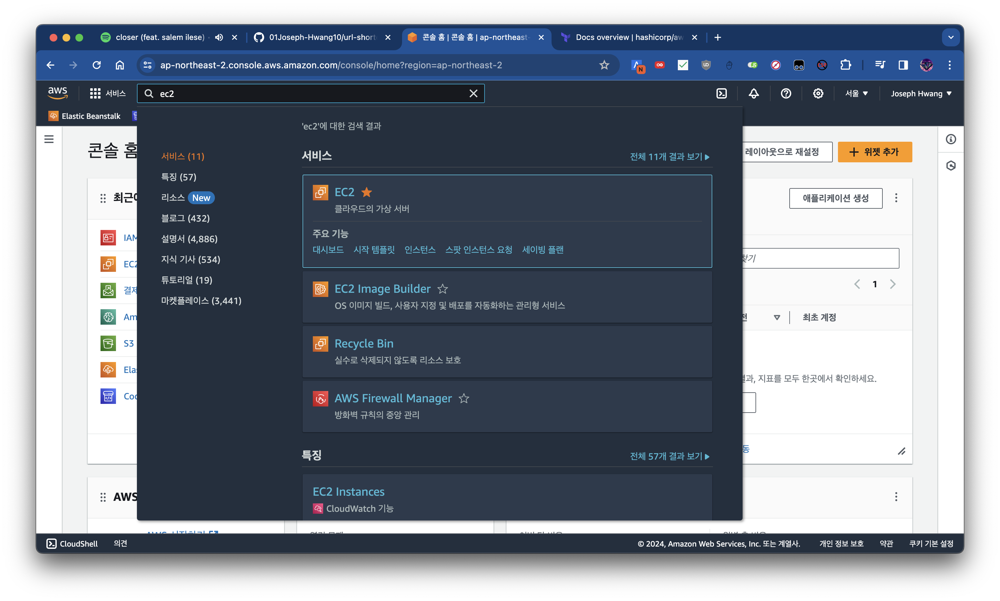

### 3. EC2 인스턴스 시작 버튼 클릭

아래와 같은 EC2 대시보드가 표시됩니다. EC2 대시보드에서 `인스턴스 시작` 버튼을 클릭합니다.

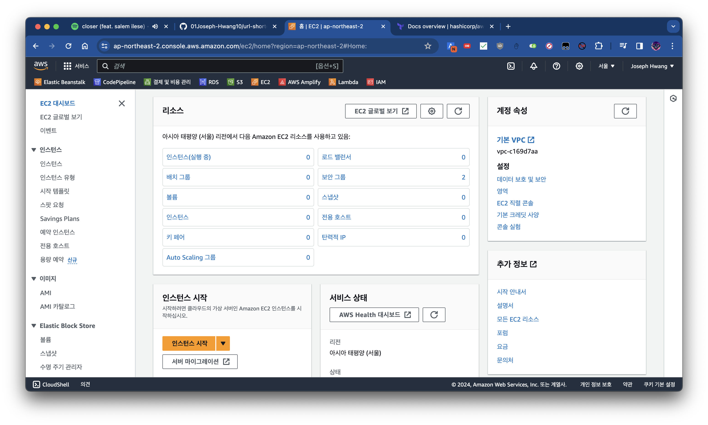

### 4. EC2 인스턴스 이름 기입

아래 사진 처럼 인스턴스 이름을 기입합니다.

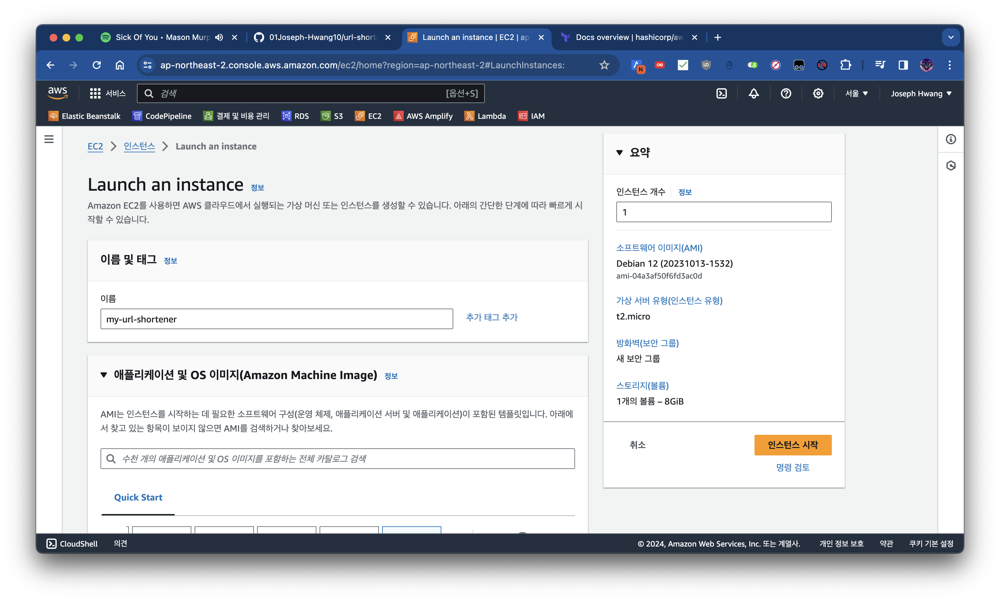

### 5. AMI 선택

[AMI](https://docs.aws.amazon.com/ko_kr/AWSEC2/latest/UserGuide/AMIs.html)유형 중 하나를 선택합니다. (본 과제에서는 `Debian 12`를 이용합니다.)

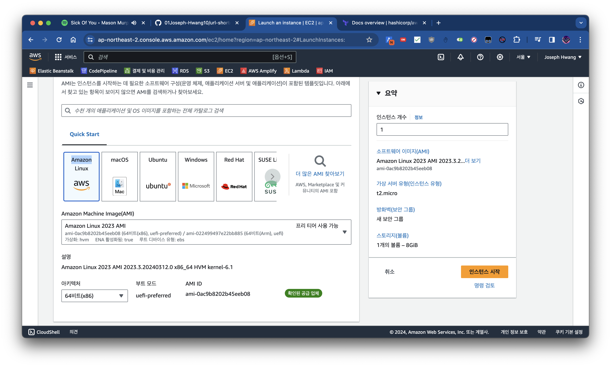
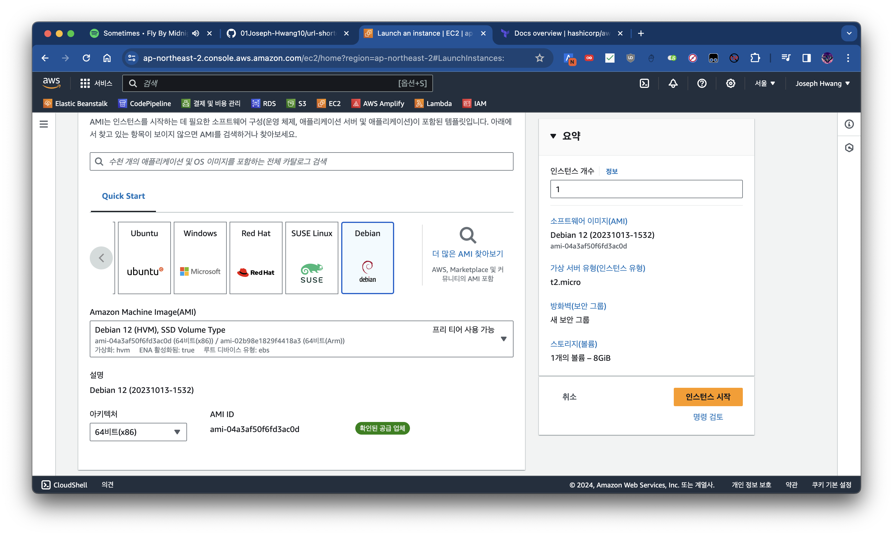

### 6. 인스턴스 유형 선택

인스턴스 유형을 선택합니다. (본 과제에서는 프리티어를 지원하는 `t2.micro`를 이용합니다.)

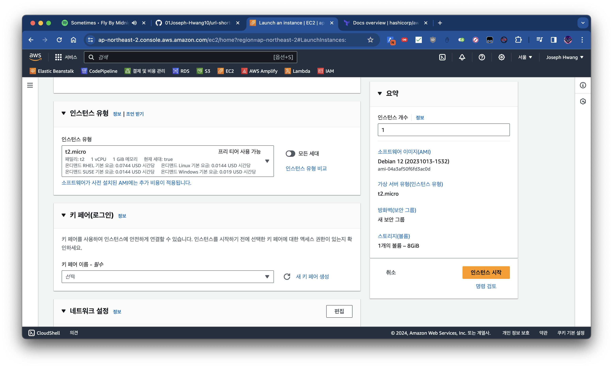

### 7. 인스턴스 접속을 위한 키페어 생성

인스턴스에 접속하기 위한 키페어를 생성합니다. 키페어를 생성하지 않으면 인스턴스에 접속할 수 없습니다.

추후 키페어 관리를 용이하게 하기 위해, 
키페어를 생성할 때는 직관적이고 기억하기 쉬운 이름으로 생성하는 것을 권장합니다.

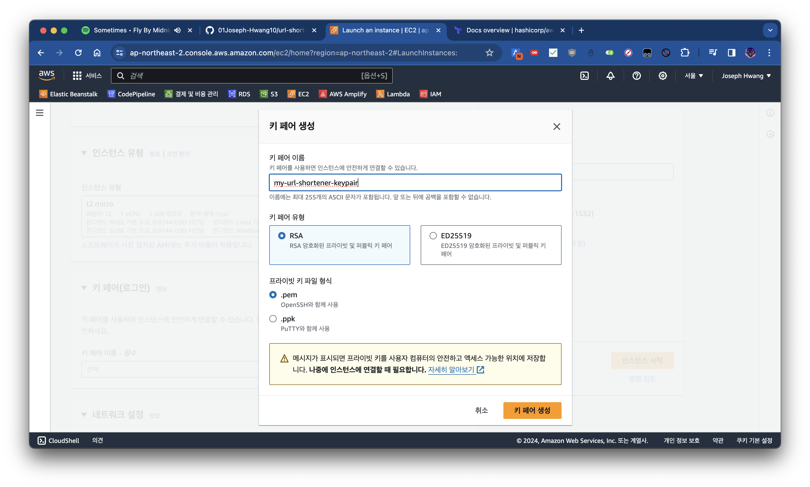

### 8. 보안 그룹 설정

인스턴스에 접속하기 위한 포트를 열어주기 위해 보안 그룹을 설정합니다.

보안 그룹은 아래 사진처럼 HTTP, HTTPS 트래픽을 허용해야 합니다.

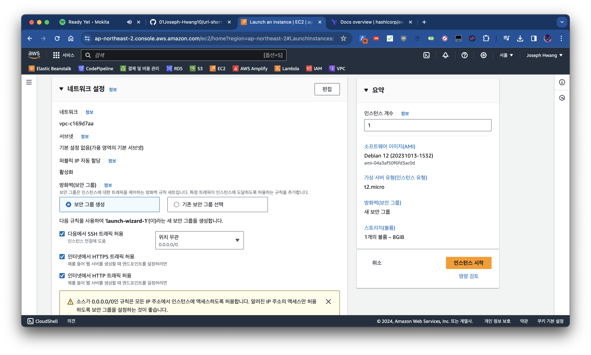

### 9. 인스턴스 시작

위의 모든 과정을 마치고 `인스턴스 시작` 버튼을 클릭합니다. 아래와 같이 생성 성공 메시지가 표시되면 성공적으로 EC2 인스턴스를 생성한 것입니다.

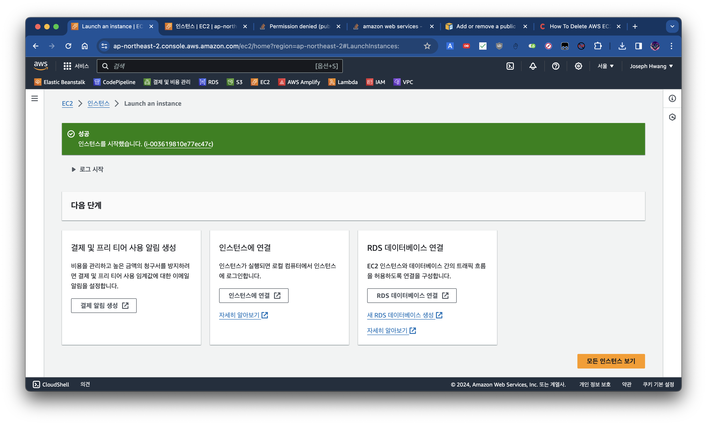

생성한 인스턴스는 EC2 대시보드 사이드바의 `인스턴스` 항목에서 확인할 수 있습니다.

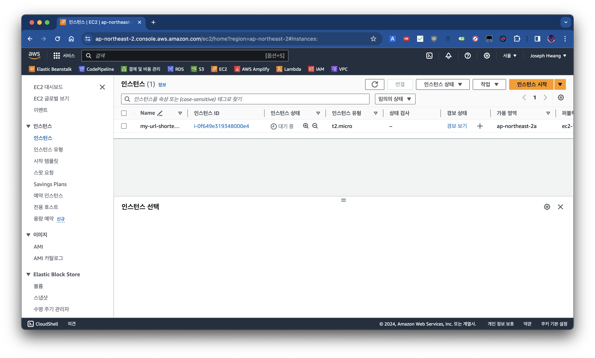
